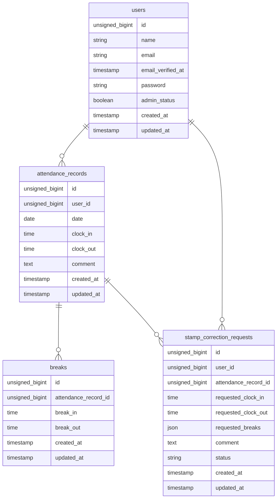

# attendance-APP

 このリポジトリは、Laravelを利用した勤怠管理アプリです。
 元々は学習用教材をベースに開発したアプリですが、ポートフォリオ公開にあたり
 不具合などの修正、却下機能の追加、配色・フォントなどのデザイン刷新に加え、
 会員登録なしで試せるデモ用ログインと、デモ環境の定期リセット機能を追加しました。


## 使用技術

- フレームワーク：Laravel 12.x
- 言語          ： PHP 8.2
- Webサーバー   ： Nginx
- データベース  ： MySQL 8.0
- コンテナ管理  ： Docker Compose
- DB管理ツール  ： phpMyAdmin
- メールテスト  ： MailHog

## ER図



## 開発環境URL

- http://localhost:8083/
- phpMyAdmin：http://localhost:8080/
- メール確認URL (MailHog): http://localhost:8025/

## テスト用ログインユーザー
*全てメール認証済み

ログイン画面・管理者ログイン画面には「デモ用ログイン」ボタンを用意しています。
一般ログイン画面の「デモ用従業員としてログイン」、管理者ログイン画面の「デモ用管理者としてログイン」を押すと、
下記の固定アカウントにパスワード入力なしでログインできます(手入力でのログインも従来どおり可能です)。

### 一般ユーザー
- **従業員1**
  - メールアドレス: `demo@example.com`
  - パスワード: `demo1234`
- **従業員2**
  - メールアドレス: `demo2@example.com`
  - パスワード: `demo1234`

### 管理者ユーザー
- **管理者（admin_status=true）**
  - メールアドレス: `test@example.com`
  - パスワード: `password`


## 動作環境

- OS: Windows 11 (WSL2 / Ubuntu)
- Docker Desktop


## 環境構築手順

1. **リポジトリをクローン**

    ```bash
    git clone git@github.com:ymwork-dev/attendance-management-app.git
    ```

2. **プロジェクトディレクトリへ移動**

    ```bash
    cd attendance-management-app/src
    ```

3. **.env ファイルの作成**

    ```bash
    cp .env.example .env
    ```

4. **.env ファイルの編集**

    ```bash
    DB_CONNECTION=mysql
    DB_HOST=attendance-db
    DB_PORT=3306
    DB_DATABASE=attendance_db
    DB_USERNAME=root
    DB_PASSWORD=root_password
    ```

5. **Docker Composeディレクトリへ移動**

    ```bash
    cd ..
    ```

6. **コンテナの起動**

    ```bash
    docker compose up -d --build
    ```

7. **Composerパッケージをインストール**

    ```bash
    docker compose exec php composer install
    ```

8. **アプリケーションキーの生成**

    ```bash
    docker compose exec php php artisan key:generate
    ```

9. **マイグレーション・シーディングを実行**

    ```bash
    docker compose exec php php artisan migrate:fresh --seed
    ```

> **補足**
>
> docker compose up -d --build を実行すると、node コンテナで npm install と Vite開発サーバー（npm run dev）が自動的に実行されます。そのため、追加で npm install や npm run dev を実行する必要はありません。

## デモ環境のリセット

公開デモ環境で溜まったデータを初期状態に戻すためのコマンドを用意しています。

```bash
docker compose exec php php artisan demo:reset          # 確認あり
docker compose exec php php artisan demo:reset --force  # 確認なし(自動実行用)
```

中身は `migrate:fresh --seed` の実行のみです。
`routes/console.php` に毎日 4:00 実行のスケジュールを登録済みなので、
公開サーバー側の crontab に次の1行を追加すると自動でリセットされます。

```cron
* * * * * cd /path/to/project/src && php artisan schedule:run >> /dev/null 2>&1
```

## テスト実行

```bash
docker compose exec php php artisan test
```

## 機能一覧

- **デモ用ログイン** ログイン画面・管理者ログイン画面のボタンから、会員登録なしで固定のデモアカウントにログインできる
- **スタッフ認証・メール認証** 新規会員登録、ログイン・ログアウト、MailHog連携による認証制限
- **勤怠登録** スタッフユーザーは自身の出勤時刻・退勤時刻・休憩開始時刻・休憩終了時刻の打刻ができる
- **勤怠一覧の確認** スタッフユーザーは自身の勤怠月情報を確認できる
- **勤怠詳細の確認、修正申請機能** スタッフユーザーは自身の勤怠詳細を確認・修正申請ができる
- **申請一覧からの確認** スタッフユーザーは自身の修正申請一覧から承認待ち・承認済み・却下済みを確認できる
- **勤怠レポートの確認** スタッフユーザーはマイ勤怠レポートを確認できる

- **管理者のログイン認証** 管理者は管理者機能にログイン・ログアウトができる
- **管理者用勤怠一覧の確認** 管理者は日にち毎のスタッフ勤怠情報を確認できる
- **管理者用勤怠詳細の確認・修正** 管理者は勤怠詳細の確認と、打刻時刻を直接修正できる
- **スタッフ一覧の勤怠情報確認** 管理者はスタッフ一覧からスタッフの勤怠情報を確認できる
- **スタッフ毎の勤怠情報確認**管理者はスタッフ一覧の詳細からスタッフ毎の勤怠情報を確認・csv出力ができる
- **管理者用申請一覧の確認機能** 管理者は申請一覧から修正の承認待ち・承認済み・却下済みの勤怠情報が確認できる
- **勤怠修正申請の承認機能** 管理者は申請された勤怠修正情報を承認・却下ができる


## APIエンドポイント一覧
外部アプリケーションから勤怠データを取得・操作できるエンドポイントを提供しています。
読み取り系（GET）は認証不要、書き込み系（POST / PUT / DELETE）は Laravel Sanctum 認証必須 で、PUT / DELETE は AttendanceRecordPolicy による認可（本人または管理者のみ操作可）が適用されます。

| HTTPメソッド | URI | 概要 |
|---|---|---|
| GET | /api/v1/attendance-records | 勤怠一覧を取得 |
| GET | /api/v1/attendance-records/{attendanceRecord} | 勤怠詳細を取得 |
| POST | /api/v1/attendance-records | 勤怠を新規登録 |
| PUT | /api/v1/attendance-records/{attendanceRecord} | 勤怠情報を更新 |
| DELETE | /api/v1/attendance-records/{attendanceRecord} | 勤怠情報を削除 |

